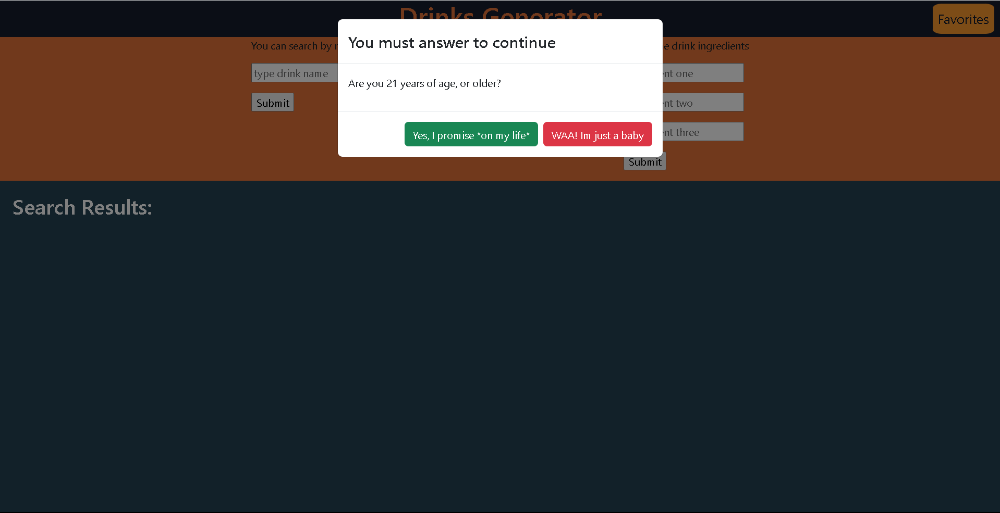
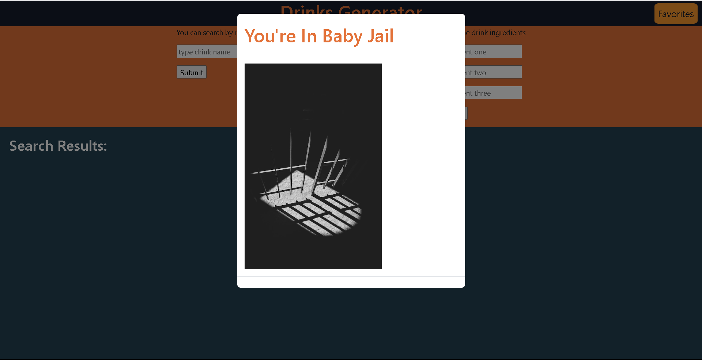
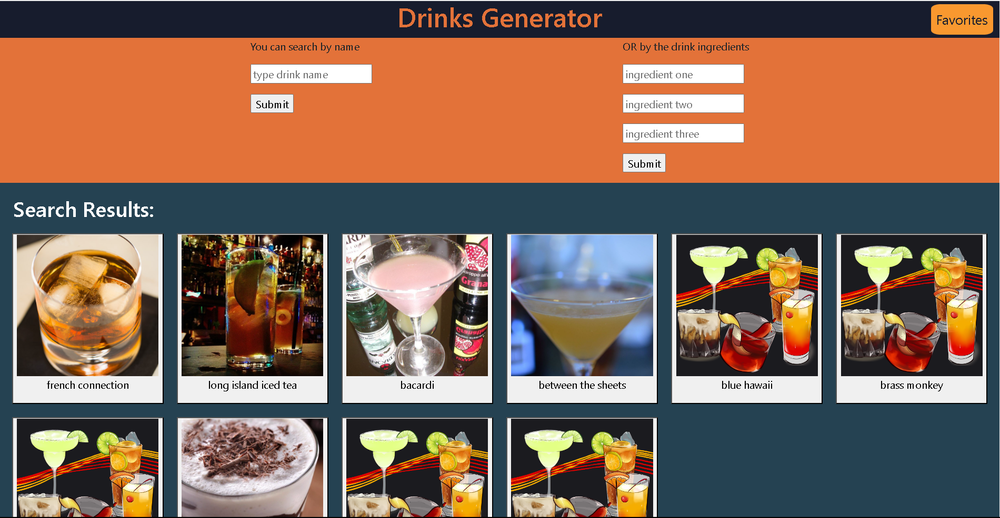
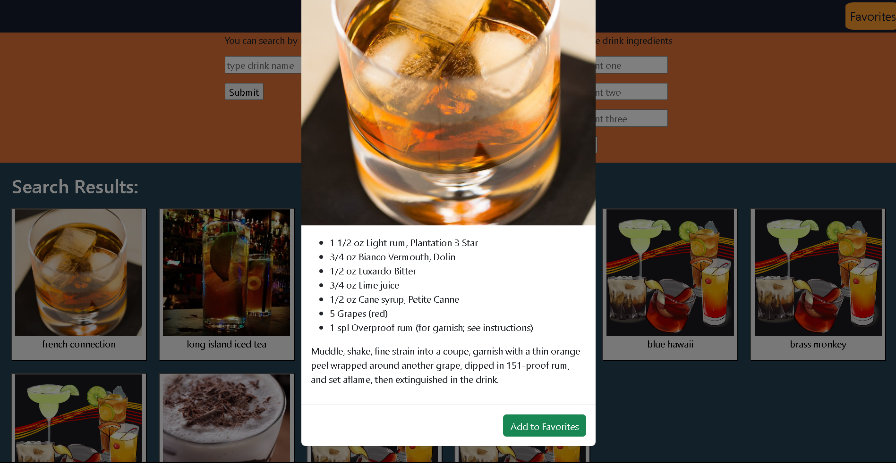
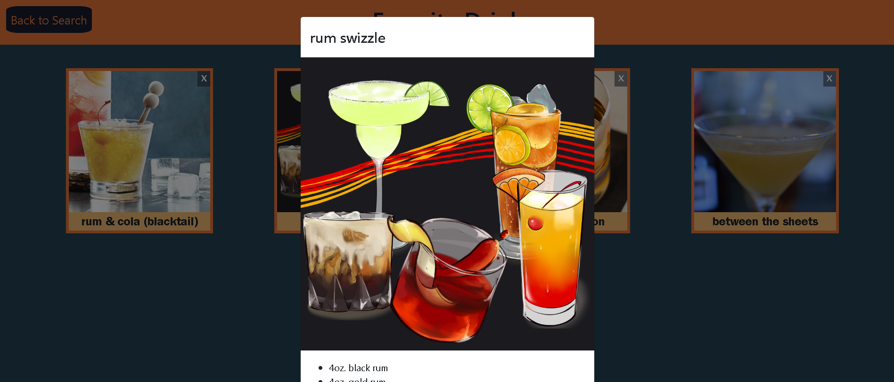
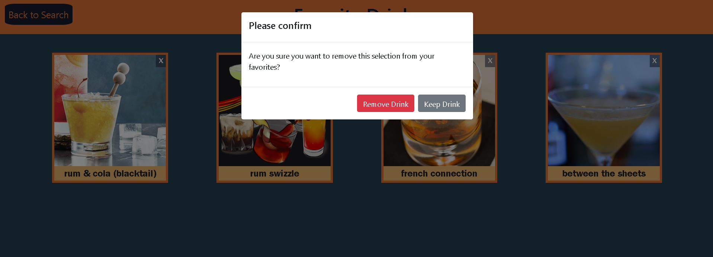

# Cocktail Generator 

## User Story

As a person who wants to make a cocktail

I WANT to see what cocktails are available to me based off ingredients
SO THAT I can use the ingredients I already own to make a delicious cocktail

I WANT to be able to save cocktails I enjoy to a favorites list
SO THAT I can easily access those drink recipes again

## Acceptance Criteria
Given a cocktail generator with form inputs

WHEN I search for a cocktail by name/search words
THEN I am given a list of cocktails that include the search words

WHEN I search for a cocktail by an ingredient
THEN I am given a list of cocktails that use that ingredient

WHEN I want a beverage without alcohol
THEN I have the option to select for mocktails only

WHEN I find a cocktail I like
THEN I can save it to my "Favorite Cocktails" list

WHEN I view saved cocktails
THEN I am presented with a list / grid of photos of the cocktails I've saved

WHEN I view a cocktails recipe
THEN I it is added to my most recently viewed at the bottom of the page

## Screen Shots

